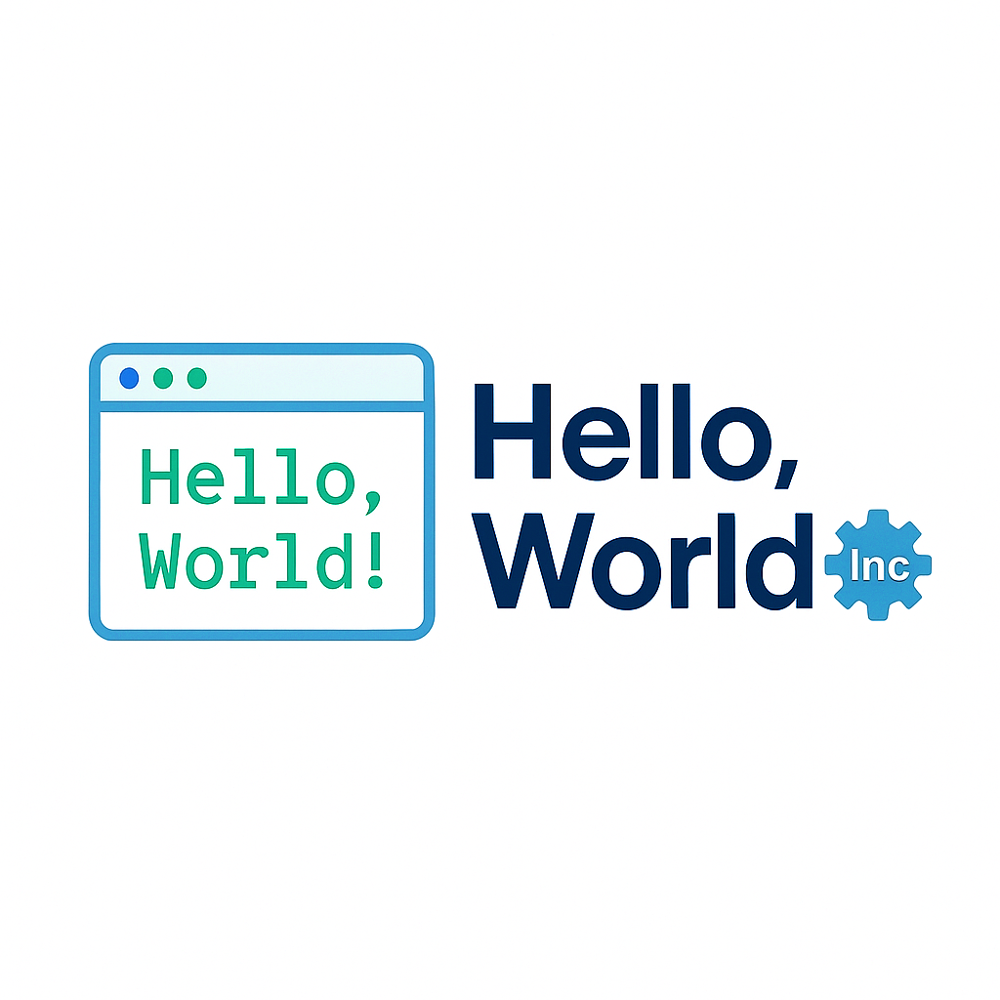
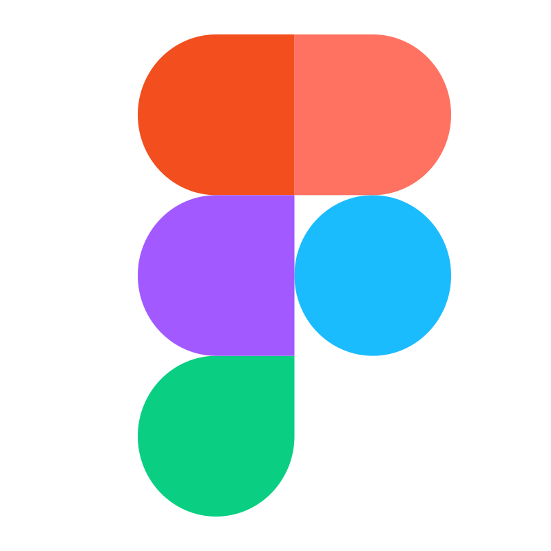
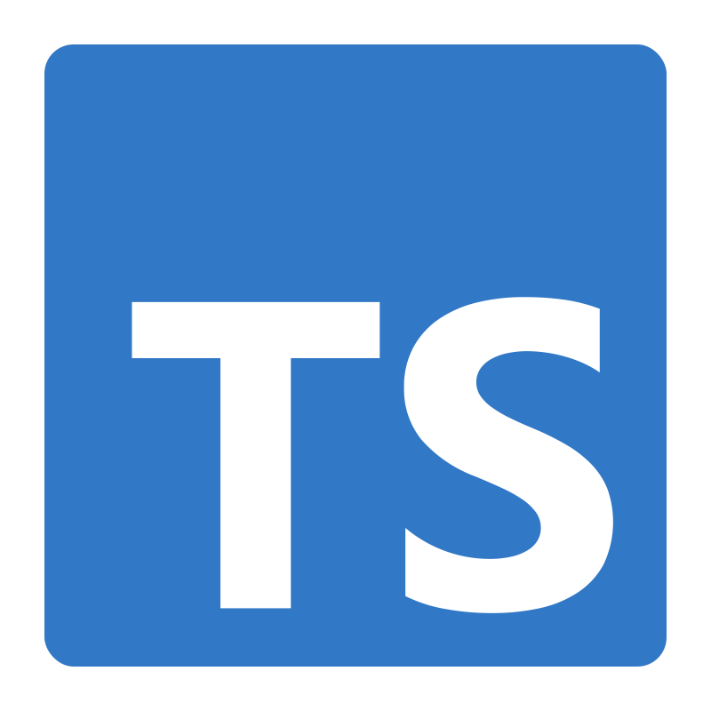
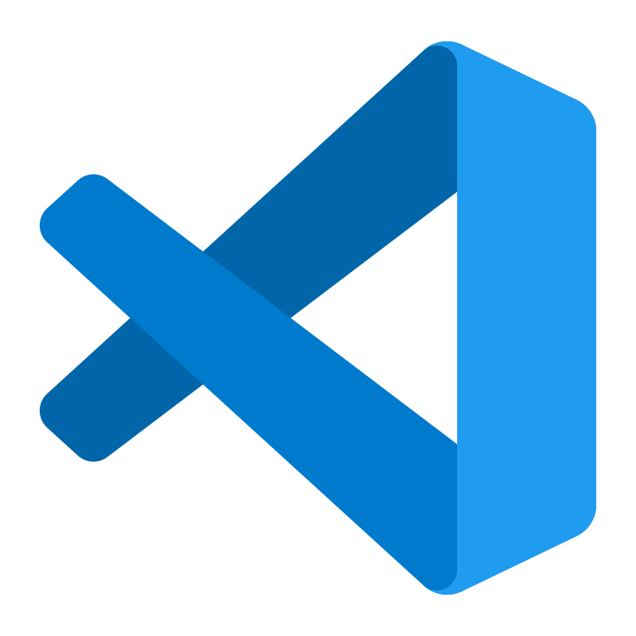
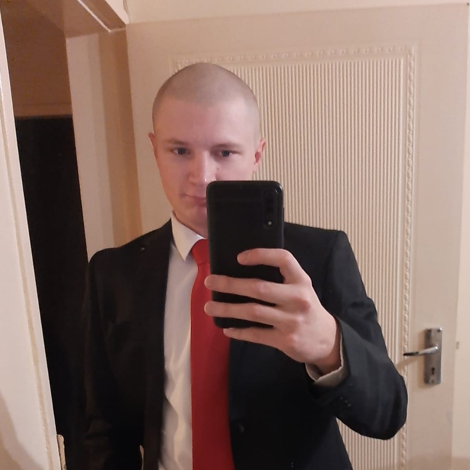

<div align="center">

# Hello World Inc - B.R.A.D - COS301 Capstone

</div>

<p style="text-align: center;">

<div align="center">
    
</div>

</p>

<div align="center">

# B.R.A.D. Tyto Insights x DNS.Business

</div>

<!-- [](/LICENSE)
[]()
[]()
[] -->

[]()
[]()
[]()
[]()

# Overview

This repository contains our team's **B.R.A.D. (Bot to Report Abusive Domains)** project, **a cybersecurity web application** that automates the analysis of potentially malicious URLs. Users can submit suspicious links through the website, where an AI-powered bot safely visits and analyzes the domain. The system extracts metadata, detects threats like malware, and compiles forensic reports. All findings are aggregated into a centralized platform that supports **incident reporting, dashboard visualization, and historical threat analysis**.

## Contents:

- [Documentation](#documentation)
- [Demo videos](#demo-videos)
- [Installation](#installation)
- [Technologies used](#technologies-used)
- [Team](#team-members)
- [Contact Us](#contact-us)

## Repository Structure

```
📂 BRAD
├── 📂 backend/             # backend and data storage
├── 📂 bot/                 # Used to analyze reports
├── 📂 frontend/            # UI
├── 📂 docs/                # Documentation
├── 📄 README.md            # Project overview
├── 📄 docker-compose.yml   # Docker setup
├── 📄 .gitignore           # Ignore unnecessary files
├── 📄 .dockerignore        # Ignore unnecessary files
```

## Documentation

- [SRS Document](/docs/SRS_Document.md)
  <!-- - [Design specifications](/docs/DesignRequirements.md) -->
  <!-- - [Service Contract](/docs/Service_Contracts.md) -->
  <!-- - [User Stories](/docs/User_Stories.md) -->
  <!-- - [Architectural Requirements](/docs/Architectural_Requirements.md) -->
  <!-- - [Quality Requirements](/docs/Quality_Requirements.pdf) -->
- [Github Contributions](/docs/GitHub_Contributions.md)
    <!-- - [Github Contributions](/docs/requirement-specs/GitHub-contributions.pdf) -->
    <!-- - [API Documentation](/docs/requirement-specs/API_Documentation.md) -->
- [Older Versions](/docs/versions/)

## Demo Videos

- [Demo 1 pdf](/docs/demo-files/Demo1.pdf)
- [Demo 1 video](https://drive.google.com/file/d/1Sao8gPITNV2-APj4J4pW27-Gpho8C8op/view?usp=sharing)

<!-- - [MP4-Demo1](https://drive.google.com/file/d/17mjbkHNwQ7dw3W5S9SFvYshkr1r34ICE/view?usp=sharing)
- [MP4-Demo1.pdf](/docs/requirement-specs/MP4-Demo1.pdf)
- [MP4-Demo2](https://drive.google.com/file/d/19o50OhefAFh2qgN6Zg8dnNXcm8-NMJCH/view?usp=sharing)
- [MP4-Demo2.pdf](/docs/requirement-specs/MP4-Demo2.pdf) -->

## Project

- [Project Board](https://github.com/orgs/COS301-SE-2025/projects/220/views/1)
- [Project Plan](/docs/Project-plan.md)
- [Burn Down Charts](/docs/burn-down-charts.md)

## Installation

### **1. Clone the Repository**

```sh
git clone https://github.com/COS301-SE-2025/BRAD.git

cd BRAD
```

### **_Docker not running yet_**

### **2. Running the Project (Docker)**

Ensure you have **Docker** installed, then run:

(first time only)

```sh
docker compose build
```

then

```sh
docker compose up
```

<!-- This will start the **daemon, API, CLI, and UI**. -->

### **3. Viewing the Project**

You should see a message similar to this:

```sh
Local: http://localhost:5173/
```

Simply type this link into a browser to view the project.

### **4. Running Tests**

<!-- Tests can be run locally using [Act](https://github.com/nektos/act), which provides developers with the ability to run GitHub workflows locally.
To do this, first install Act and then simply run the `act` command. To run specific tests the `-W` can be specified as follows:

```sh
act -W path/to/workflow.yml
``` -->

## Technologies used

<p style="text-align: center;">
    
    
    
    
    <!--  -->
    
    <!--  -->
    <!--  -->
    
</p>

## CI/CD & GitHub Actions

<!-- - **CI/CD** is handled using **GitHub Actions**.
- On each push, the pipeline will:
  - **Run tests** (unit, integration, E2E)
  - **Build the project**
  - **Deploy to a containerized environment** -->

## Contribution Outline

1. **Create a branch** for your feature: `git checkout -b feature-name`
2. **Commit changes** with clear messages.
3. **Open a Pull Request (PR)** for review.
4. **Ensure tests pass** before merging. -->

## Team members

<!-- sdf -->

|                                                                                                                                                                  | Description                                                                                                                                                                                                                                                                                                                                                                                                                                                                                                                                                                                                                                                                                                                                                                                                   | Links                                                                                                                                                                                                                                               |
| ---------------------------------------------------------------------------------------------------------------------------------------------------------------- | ------------------------------------------------------------------------------------------------------------------------------------------------------------------------------------------------------------------------------------------------------------------------------------------------------------------------------------------------------------------------------------------------------------------------------------------------------------------------------------------------------------------------------------------------------------------------------------------------------------------------------------------------------------------------------------------------------------------------------------------------------------------------------------------------------------- | --------------------------------------------------------------------------------------------------------------------------------------------------------------------------------------------------------------------------------------------------- |
|  <br> E (Ethan) Vletter u22497082 <br> Project Manager, DevOps | I am a final-year BSc Computer Science student with solid experience leading project teams. <br> I never pretend to have all the answers, whether it’s feedback from other engineers or simply someone giving a tip on a better color palette. I want to listen and learn before I start to earn.                                                                                                                                                                                                                                                                                                                                                                                                                                                                                                             | [](https://www.linkedin.com/in/ethan-vletter/) [](https://github.com/EthanVletter)                |
|  <br> TS (Tebatso) Mahlathini u22611704 <br> API, DevOps | I'm a 3rd-year student in information and knowledge systems, with a primary focus in computer science and secondary studies in multimedia and informatics. Because of this broad academic foundation, I can work in both frontend and backend development. <br>I'm a hardworking and adaptable individual who learns quickly in group settings. I've worked on several group projects where I've improved my communication skills and often helped with achieving positive results. Im eager to learn new technologies and take on new challenges                                                                                                                                                                                                                                                             | [](https://www.linkedin.com/in/tebatso-mahlathini-30864b256/) [](https://github.com/tebatsoSophy) |
|  <br> C (Carinda) Smith u22652974 <br> API               | I am a final-year BSc student in Information and Knowledge Systems, with a specialization in Data Science. My skills are Java and MySQL, but I also have experience with frontend development and API integration. I'm a quick learner with the tenacity to take on new challenges, whether it's learning a new language or troubleshooting complex issues under pressure. Working on many group projects has helped me develop excellent teamwork, adaptability, and communication skills. I enjoy building clean, user-friendly interfaces, developing secure and scalable APIs, and managing data-driven backends. Above all, I'm a dependable coworker who prioritizes quality and is dedicated to providing intelligent, user-centered solutions in any development context.                             | [](http://www.linkedin.com/in/carinda-smith-a01a9430a) [](https://github.com/carinda-smith)       |
|  <br> M (Megan) Pretorius u23708833 <br> UI              | I am a hardworking and motivated final-year BSc Computer Science student at the University of Pretoria with a strong technical foundation, keen attention to detail, and a passion for solving complex problems. I bring a unique combination of analytical thinking and creative problem-solving, which allows me to tackle technical challenges with innovative solutions. <br> My ability to quickly understand and adapt to new technologies makes me a valuable asset in any software development team. I’m also bilingual, a confident communicator, and excel under pressure. I’ve worked on various collaborative projects where my organizational skills ensured timely delivery and high team morale. I thrive in fast-paced environments and always bring a proactive, can-do attitude to my work. | []() []()                                                                                         |
|  <br> S (Salome) Kalaka u19364742 <br> API               | A third-year BSc Computer Science student at the University of Pretoria, passionate about mathematics and coding. My interests include Data Science, Machine Learning and AI. I hold a Machine Learning certificate from MATLAB and enjoy applying theoretical knowledge to real-world challenges. I thrive in collaborative environments and bring a strong problem-solving mindset to every project. I also participate in hackathons not only to win but to expose myself to diverse real-life problems that build the practical experience I need to excel in my field. I believe that consistent practice is key to mastering any process.                                                                                                                                                               | []() []()                                                                                         |

## Contact Us

cos301.cap2@gmail.com
