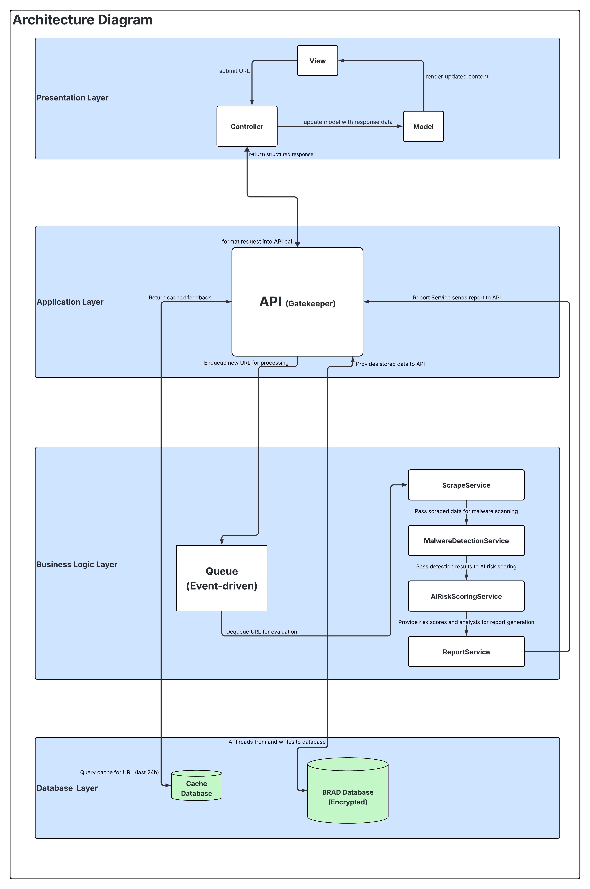

<!-- omit in toc -->

# Software Requirement Specifications

 

<!-- omit in toc -->

# Table of Contents

- [Introduction](#introduction)
  - [Business Need](#business-need)
  - [Project Scope](#project-scope)
- [User Stories](#user-stories)

  - [1. Role: General user(Reporter)](#1-role-general-userreporter)
  - [2. Role:Investigator](#2-roleinvestigator)
  - [3. Role:Admin](#3-roleadmin)

- [Use Cases for Demo 1](#use-cases-for-demo-1)

  - [Use Case 1: Submit Domain Report](#use-case-1-submit-domain-report)
  - [Use Case 2: View Submitted Reports](#use-case-2-view-submitted-reports)
  - [Use Case 3: Analyse Forensic](#use-case-3-analyse-forensic)
  - [Complete Use Case Diagrams](#complete-use-case-diagrams)

- [Use Cases for Demo 2](#use-cases-for-demo-2)
  - [Use Case 1: Admin Adds a New User](#use-case-1-admin-adds-a-new-user)
  - [Use Case 2: Admin’s User Management](#use-case-2-admins-user-management)
  - [Use Case 3: Investigator Analyzes Report Using Bot Response](#use-case-3-investigator-analyzes-report-using-bot-response)
  - [Use Case 4: Reset or Change Password](#use-case-4-reset-or-change-password)
- [Functional Requirements](#functional-requirements)
  - [Core Requirements](#core-requirements)
    - [1.1. User Submission Portal](#11-user-submission-portal)
    - [1.2. Scraping \& Malware Detection](#12-scraping--malware-detection)
    - [1.3. Forensic Data Collection](#13-forensic-data-collection)
    - [1.4. AI Risk Analysis](#14-ai-risk-analysis)
    - [1.5. Evidence Submission](#15-evidence-submission)
    - [1.6. Investigator Dashboard](#16-investigator-dashboard)
    - [1.7. Secure Storage](#17-secure-storage)
  - [Optional Features](#optional-features)
    - [2.1. Threat Intelligence Lookup](#21-threat-intelligence-lookup)
    - [2.2. Automated WHOIS \& DNS](#22-automated-whois--dns)
    - [2.3. Domain Similarity Detection](#23-domain-similarity-detection)
    - [2.4. Real-Time Alerts](#24-real-time-alerts)
    - [2.5. Historical Tracking](#25-historical-tracking)
    - [2.6. Multi-Language Support](#26-multi-language-support)
  - [3. Wow Factors](#3-wow-factors)
    - [3.1. Live Sandbox Testing](#31-live-sandbox-testing)
    - [3.2. Machine Learning Risk Scores](#32-machine-learning-risk-scores)
    - [3.3. Automated Threat Hunting](#33-automated-threat-hunting)
    - [3.4. Blockchain Evidence](#34-blockchain-evidence)
    - [3.5. Auto Takedown Requests](#35-auto-takedown-requests)
    - [3.6. Dark Web Checks](#36-dark-web-checks)
- [Service Contracts](#service-contracts)
  - [1. User Authentication](#1-user-authentication)
    - [Login](#login)
    - [Register](#register)
  - [2. Domain Submission](#2-domain-submission)
    - [Submit Suspicious Domain](#submit-suspicious-domain)
  - [3. Internal Bot Analysis](#3-internal-bot-analysis)
    - [Analyze Domain (Internal)](#analyze-domain-internal)
  - [4. Reports](#4-reports)
    - [View Domain Report](#view-domain-report)
  - [5. Evidence Management](#5-evidence-management)
    - [Upload Evidence](#upload-evidence)
- [Domain Model](#domain-model)

## Table of Contents

1. [Architectural Requirements](#architectural-requirements)
2. [Architectural Design Strategy](#architectural-design-strategy)
   - [Making It Easy to Use](#making-it-easy-to-use)
   - [Building at a Steady Pace](#building-at-a-steady-pace)
   - [Keeping the System Safe and Reliable](#keeping-the-system-safe-and-reliable)
   - [Collaboration](#collaboration)
   - [Adapting to Change](#adapting-to-change)
   - [Step-by-Step Improvements](#step-by-step-improvements)
   - [Customer Trust and Frequent Progress](#customer-trust-and-frequent-progress)
3. [Architectural Styles](#architectural-styles)
   - [Event-Driven Architecture (EDA)](#event-driven-architecture-eda)
   - [Gatekeeper Pattern](#gatekeeper-pattern)
   - [Client-Server Model](#client-server-model)
   - [Layered Architecture](#layered-architecture)
   - [Pipe and Filter Pattern](#pipe-and-filter-pattern)
4. [Architectural Quality Requirements](#architectural-quality-requirements)
   - [1. Security (Most Important)](#1-security-most-important)
   - [2. Compliance](#2-compliance)
   - [3. Reliability](#3-reliability)
   - [4. Scalability](#4-scalability)
   - [5. Maintainability](#5-maintainability)
5. [Architectural Design and Pattern](#architectural-design-and-pattern)
   - [Gatekeeper Pattern](#gatekeeper-pattern-1)
   - [Event-Driven Architecture (EDA)](#event-driven-architecture-eda-1)
   - [Service-Oriented Architecture (SOA)](#service-oriented-architecture-soa)
   - [Client-Server Model](#client-server-model-1)
   - [Layered Architecture](#layered-architecture-1)
   - [Pipe and Filter Pattern](#pipe-and-filter-pattern-1)
   - [Model-View-Controller (MVC)](#model-view-controller-mvc)
6. [Design Patterns](#design-patterns)
   - [Chain of Responsibility](#chain-of-responsibility)
7. [Architectural Constraints](#architectural-constraints)
   - [Adherence to Legal Standards and Regulations](#adherence-to-legal-standards-and-regulations)
     - [GDPR and POPIA Compliance](#gdpr-and-popia-compliance)
     - [Audit Logging and Data Traceability](#audit-logging-and-data-traceability)
     - [Access Control for Sensitive Operations](#access-control-for-sensitive-operations)
   - [Balancing Automation and Human Oversight](#balancing-automation-and-human-oversight)
     - [Human-in-the-Loop Decision Making](#human-in-the-loop-decision-making)
   - [Technical Limitations and Deployment Constraints](#technical-limitations-and-deployment-constraints)
     - [Budget and Infrastructure Limitations](#budget-and-infrastructure-limitations)
     - [Network Restrictions for Scraping](#network-restrictions-for-scraping)
     - [False Positives in AI Classification](#false-positives-in-ai-classification)
   - [Ethical and Data Handling Considerations](#ethical-and-data-handling-considerations)
     - [Data Anonymization and Minimization](#data-anonymization-and-minimization)
     - [Transparency and Explainability](#transparency-and-explainability)

- [Technology Choices](#technology-choices)
- [Appendices](#appendices)

 
 

# Introduction

The **Bot to Report Abusive Domains (B.R.A.D)** is a cybersecurity-focused application designed to automate the investigation and analysis of domain abuse reports. With the increasing prevalence of phishing websites, malware-hosting domains, and other forms of DNS abuse, organizations require efficient, secure, and intelligent tools to support cybersecurity operations.

B.R.A.D addresses this need by providing a streamlined web-based platform where users can submit suspicious URLs. Upon submission, a secure, containerized bot performs automated scraping and forensic analysis on the domain—extracting content, detecting potential malware, collecting metadata (such as WHOIS data, IP addresses, and SSL certificates), and classifying risk levels using AI techniques. The system compiles this data into structured forensic reports, which are made available to cybersecurity investigators through a dedicated dashboard.

### Business Need

Modern cyber threats are increasingly sophisticated, targeting individuals, businesses, and infrastructure through deceptive and malicious domains. Manual approaches to investigating these threats are often time-consuming and reactive. There is a clear need for an automated solution that facilitates the rapid assessment and reporting of potentially harmful domains. B.R.A.D aims to fill this gap by providing a secure, scalable system for domain abuse detection and reporting.

### Project Scope

The scope of this project includes the design and implementation of:

- A **User Submission Portal** for reporting suspicious domains
- A **Containerized Bot** for automated domain visits and content scraping
- **Forensic Data Collection** to gather and store domain intelligence
- **AI-Powered Risk Classification** to evaluate the level of threat
- An **Investigator Dashboard** for reviewing and analyzing reports
- Optional integration with threat intelligence sources and real-time alerting

The B.R.A.D system will support both a user-friendly interface and API-based access to ensure integration flexibility and ease of use.

  
 

<a href="#table-of-contents">⬆️ Back to Table of Contents</a>

 
 

# User Stories

## 1.Role: General user(Reporter)

**Description:**

- A member of the public or organization who wants to report a suspicious website.

**User Story:**

- As a general user I want to submit a suspicious domain so that I can check if it's legal and safe to use.

**Definition of done:**

- I can submit a suspicious domain via a simple form.
- I can optionally add notes or upload evidence.
- I receive confirmation that my report is submitted.
- I can track my report status and receive feedback.
- I can request to reset or change my password if I forget it.

---

## 2.Role:Investigator

**Description:**

- A cybersecurity analyst who reviews and classifies domain submissions.

**User Story:**

- As an investigator I want to view all reports submitted and their results so that I can analyse them, change their status, and send feedback to the reporter.

**Definition of done:**

- I can view all submitted reports.
- I can see risk scores and AI verdicts.
- I can open a detailed report with metadata and evidence.
- I can update the report status.
- I can send feedback to the original reporter.
- I can request to change or reset my password if I forget it.

---

## 3.Role:Admin

**Description:**

- A system administrator responsible for managing user roles.

**User Story:**

- As an admin I want to view all users and manage their roles so that I can control who has access to specific functionalities.

**Definition of done:**

- I can view all registered users and their current roles.
- I can promote a user to the role of investigator.
- I can demote an investigator to a general user.
- I can change users role to admin.
- I can create new users.
- I can request to change or reset my password if I forget it.

  
 

<a href="#table-of-contents">⬆️ Back to Table of Contents</a>

 
 

# Use cases

**Use** **cases for demo** **1**

This outlines and analyses the three main use cases of the B.R.A.D (Bot
to Report Abusive Domains) cybersecurity application. Each use case is
detailed with user perspectives,system responsibilities, and variations
in workflow depending on the implementation of automated vs manual bot
analysis.

### Use Case 1: Submit Domain Report

**User Perspective:**

The Reporter wants to submit a suspicious domain via a
simple and secure interface.They may optionally upload supporting evidence (screenshots,emails,etc.).

**System Role:**

• Validates the domain

• Stores the report in the database

•Optionally or automatically triggers the
investigation bot depending on chosen version

•Provides confirmation of submission

 

**Steps(General):**

1.  Reporter logs into the platform.

2.  Fills in the domain name.

3.  Uploads evidence(optional).

4.  Submits the report.

5.  System processes the submission accordingly.

 

**Version 1: Bot is triggered automatically u pon submission.**

• Trigger BotAnalysis becomes an\<\<include\>\>usecase.

• Investigation starts immediately in the background.

• Reporter receives a confirmation that investigation has started.

• Optional: Investigator is notified post-analysis.

 

 

**Version 2: Investigator manually launches the bot later.**

• Submission is stored and queued for human review.

• Investigator decides when to initiate investigation.

 

 

---

### Use Case 2: View Submitted Reports

**User Perspective:**

The Reporter wants to track the status of their
previous submissions,including any analysis results or reports generated by investigators.

**System Role:**

• Authenticates the user

• Retrieves and displays submission history and current statuses

• Optionally allows filtering,downloading reports,or receiving notifications

In **Version1:** statuses update quickly as bot analysis runs automatically.

In **Version2:** status may show as "AwaitingInvestigation"
until an investigator initiates the process.

 

 

---

### Use Case 3: Analyse Forensic

**User Perspective:**

The Investigator logs in to review assigned or submitted domain reports.They
access metadata, interpret bot analysis results,and provide a final analysis.

**System Role:**

• Authenticates the investigator with secure access

• Displays report information and metadata

• Runs or fetches bot out put depending on the version

• Supports visual analysis tools,export features,and escalation options

 

**Version 1: Bot is Auto Triggered**

• Investigator accesses already-analysed results

• Main task is interpretation and risk assessment

 

 
 

**Version 2: Bot is Manually Triggered**

• Investigator must explicitly launch the bot from the dashboard

• Once results are ready,analysis and reporting proceed as usual

 

 

---

### Complete use cases daigrams:

**Version 1** is ideal for
rapid,scalable analysis where automation speeds up feedback loops.

 

 
 

**Version 2** introduces flexibility and manual control for nuanced investigations.

 

  
 

<a href="#table-of-contents">

⬆️ Back to Table of Contents</a>

 
 

# Use Cases for Demo 2

---

## Use Case 1: Admin Adds a New User

**User Perspective:**

The **Admin** adds a new user by filling in user details.

**System Role:**

- Stores the new user’s username and email
- Sends a One-Time Password (OTP) to the user's email
- Redirects the user to complete their setup via the link

**Steps:**

1. Admin enters the new user's:
   - Username
   - Email
   - Role (Admin / Investigator / Reporter)
2. System sends OTP link via email
3. User clicks the link and:
   - Enters OTP
   - Enters and confirms new password
   - Gets redirected to login

## Use Case 2: Admin Manages Users

**User Perspective:**

The **Admin** wants to manage users efficiently by modifying roles or removing accounts.

**System Role:**

- Allows filtering and searching of users
- Enables role editing and deletion

**Admin Can Perform:**

- Remove user
- Edit user role:
  - Admin
  - Investigator
  - Reporter
- Filter by role
- Search by username

 

---

## Use Case 3: Investigator Analyzes Report Using Bot Response

**User Perspective:**

The **Investigator** evaluates a reported domain using bot results and evidence.

**System Role:**

- Displays bot-generated results
- Allows investigator to interpret and label the report

**Steps:**

1. View bot response
2. Mark report as malicious / not malicious
3. Add comments
4. Review supporting evidence
5. Relaunch bot if needed

 

---

## Use Case 4: Reset or Change Password

**User Perspective:**

Any **user** who has forgotten or needs to reset their password can initiate recovery.

**System Role:**

- Sends password reset link to email
- Verifies new password inputs
- Redirects back to login

### Steps to Reset Password:

1. On login screen, click **"Forgot Password"**
2. Enter email address
3. Receive email with reset link
4. Click the link and:
   - Enter new password
   - Confirm password

### Steps to Register (if not a user):

1. Click **"Register"**
2. Enter:
   - First name
   - Last name
   - Email
   - Username
   - Password
3. Already have an account? Click **"Login"**

 

---

<a href="#table-of-contents">⬆️ Back to Table of Contents</a>

# Functional Requirements

 

## Core Requirements

### 1.1. User Submission Portal

1.1.1. Provide a web form for users to report suspicious domains.  
1.1.2. Ensure ease of use with form validation and confirmation messages.

### 1.2. Scraping & Malware Detection

1.2.1. Deploy a secure, containerized bot to visit submitted domains.  
1.2.2. Extract domain content and run malware detection tools.

### 1.3. Forensic Data Collection

1.3.1. Gather metadata such as IP address, hosting provider, and registrar info.  
1.3.2. Fetch SSL certificate and WHOIS data for further analysis.

### 1.4. AI Risk Analysis

1.4.1. Use machine learning to evaluate domain content and metadata.  
1.4.2. Classify domains based on risk level or threat type.

### 1.5. Evidence Submission

1.5.1. Allow users to upload supporting files (e.g., screenshots, logs).  
1.5.2. Validate file types and scan for malware.

### 1.6. Investigator Dashboard

1.6.1. Provide a UI for analysts to review submitted reports.  
1.6.2. Include filters, sorting, and risk classification indicators.

### 1.7. Secure Storage

1.7.1. Store all data with encryption at rest and in transit.  
1.7.2. Implement access controls and secure backups.

 

## Optional Features

### 2.1. Threat Intelligence Lookup

2.1.1. Integrate with known threat intelligence APIs.  
2.1.2. Flag domains found in blacklists or reports.

### 2.2. Automated WHOIS & DNS

2.2.1. Periodically fetch and update WHOIS and DNS records.  
2.2.2. Detect ownership or server changes.

### 2.3. Domain Similarity Detection

2.3.1. Identify lookalike or typo-squatting domains.  
2.3.2. Cluster domains with similar patterns.

### 2.4. Real-Time Alerts

2.4.1. Send email, SMS, or webhook alerts for critical threats.  
2.4.2. Include context and risk score in alert payloads.

### 2.5. Historical Tracking

2.5.1. Maintain timeline of changes and reports for each domain.  
2.5.2. Track repeat offenders and escalation trends.

### 2.6. Multi-Language Support

2.6.1. Detect and process content in various languages.  
2.6.2. Include translation tools or plugins if necessary.

 

## 3. Wow Factors

### 3.1. Live Sandbox Testing

3.1.1. Execute domain resources in an isolated environment.  
3.1.2. Capture behavioral traces like redirects or script execution.

### 3.2. Machine Learning Risk Scores

3.2.1. Train models on historical data to generate risk scores.  
3.2.2. Continuously refine with analyst feedback.

### 3.3. Automated Threat Hunting

3.3.1. Use domain data to proactively scan for similar threats.  
3.3.2. Suggest new domains to monitor based on clustering.

### 3.4. Blockchain Evidence

3.4.1. Store report hashes on a blockchain for integrity proof.  
3.4.2. Enable public verification of report authenticity.

### 3.5. Auto Takedown Requests

3.5.1. Generate pre-filled abuse reports for registrars.  
3.5.2. Track status of takedown actions.

### 3.6. Dark Web Checks

3.6.1. Monitor dark web forums or marketplaces for domain mentions.  
3.6.2. Flag domains associated with underground activity

  
 

<a href="#table-of-contents">⬆️ Back to Table of Contents</a>

 
 

# Service Contracts

 

## 1. User Authentication

### Login

**Service Contract Name:** `POST /api/auth/login`

**Parameters:**
{ "email": "string", "password": "string" }

**Pre-conditions:**

- The user must be a registered user.
- A valid registered email address and password must be provided.

**Post-conditions:**

- The user is signed into the system and navigated to one of the two dashboards based on their access role.

**Scenario:**
The user enters their email and password on the login page. The system verifies the credentials and either grants access, navigating the user to one of the two dashboards, or denies access and prompts them to try again.

---

### Register

**Service Contract Name:** `POST /api/auth/register`

**Parameters:**
{ "name": "string", "email": "string", "password": "string" }

**Pre-conditions:**

- The email must not already be registered.
- All fields must be filled in with valid values:

  - **email:** Valid email format
  - **name:** Minimum length (e.g., 2 characters)
  - **password:** Meets security requirements (e.g., min 8 characters, mix of letters/numbers)

**Post-conditions:**

- A new user account is created and stored in the database.
- The user receives a confirmation (auto-login or verification link).
- A token is returned to start the user session (used in API header).

**Scenario:**
A new user accesses the registration page and fills in their name, email, and password. The system validates the input, creates the account, and either logs the user in or sends a verification email. If the email already exists or input is invalid, an error message is shown.

 

## 2. Domain Submission

### Submit Suspicious Domain

**Service Contract Name:** `POST /api/domains/report`

**Parameters:**
{ "domain": "string", "evidenceFile": "File (optional)" }

**Pre-conditions:**

- The domain field must be non-empty and in a valid format (e.g., begins with http\:// or https\://).
- If evidence is attached, it must be PDF, JPG, or PNG and below 10MB.

**Post-conditions:**

- The domain is stored with status "queued".
- If evidence is attached, it is securely saved and linked to the submission.
- A confirmation or error message is returned.

**Scenario:**
The reporter enters a suspicious URL, optionally uploads evidence, and submits. The system validates, queues the domain, and returns a success or failure message.

 

## 3. Internal Bot Analysis

### Analyze Domain (Internal)

**Service Contract Name:** `BOT /internal/analyse-domain`

**Parameters:**
{ "submissionID": "UUID" }

**Pre-conditions:**

- Domain must exist with status "queued".
- A sandboxed Docker container must be available.

**Post-conditions:**

- Metadata (IP, WHOIS, SSL, etc.) is extracted.
- Domain is checked for malware.
- Results are stored and status updated.

**Scenario:**
System detects a "queued" domain and invokes the bot. The bot analyzes the domain in a sandbox and updates the report.

 

## 4. Reports

### View Domain Report

**Service Contract Name:** `GET /api/reports/{domainId}`

**Parameters:**
{ "domainId": "UUID" }

**Headers:**
`Authorization: Bearer <token>`

**Pre-conditions:**

- User must be authenticated and have permission.
- Report must exist.

**Post-conditions:**

- A JSON or UI-based report is returned.
- Optional PDF/CSV download link provided.

**Scenario:**
The user selects a domain report from the dashboard. The system retrieves and displays it. Errors are shown if not found or unauthorized.

 

## 5. Evidence Management

### Upload Evidence

**Service Contract Name:** `POST /api/evidence/upload`

**Parameters:**
{ "submissionId": "UUID", "file": "File" }

**Pre-conditions:**

- Submission must exist.
- File must be PDF, JPG, or PNG and below size limit.

**Post-conditions:**

- File is stored and linked to the domain submission.
- User receives success or failure message.

**Scenario:**
User uploads additional proof. The system validates and stores the file, linking it to the submission.

  
 

<a href="#table-of-contents">⬆️ Back to Table of Contents</a>

 
 
 
 

# Domain Model

  

 
 

<a href="#table-of-contents">⬆️ Back to Table of Contents</a>

 
 

**Architectural** **Requirements**

**Architectural** **Design**
**Strategy:** **Design** **based** **on** **Quality** **Requirements**

**Making** **It** **Easy** **to** **Use**

Usability is just as important as functionality. We design dashboards
and submission pages that are simple and clear so that users don’t get
confused. This helps reporters submit suspicious domains quickly and
investigators work efficiently with the tools we provide.

**Building** **at** **a** **Steady** **Pace**

Agile encourages teams to work at a pace they can keep up. By focusing
on performance and clean structure, we avoid messy code and make sure
the system is efficient and doesn’t slow down as it grows. This helps
the team avoid burnout and reduces problems later.

**Keeping** **the** **System** **Safe** **and** **Reliable**

Since BRAD works with sensitive information, we always think about
security and reliability in our design. We implement strong access
control, monitor system activity, and handle failures in a way that
doesn’t put data or users at risk. This ensures that the system keeps
working even under stress.

**Collaboration**

When we design based on clear quality requirements, everyone on the team
knows what matters most. Whether someone is working on the frontend or
backend, we all follow the same goals like making the system easy to
use, secure, and quick. This makes teamwork smoother and more focused.

**Adapting** **to** **Change**

Cyber-security threats change quickly. Designing around scalability and
maintainability helps us make changes without breaking the system. This
means we can update the scraper, switch AI models, or add new features
easily. It also lets us respond to new ideas or feedback from users as
the project goes on.

**Step-by-Step** **Improvements**

We build BRAD in small steps. Each sprint adds something new like
scraping, AI analysis, or reporting. By keeping each step small and tied
to a quality goal (like performance or accuracy), we make sure we’re
always improving the system in a smart and manageable way.

**Customer** **Trust** **and** **Frequent** **Progress**

We want users and stakeholders to feel confident in what we’re building.
By focusing on quality requirements like security, reliability, and
usability, we make sure that every version of the BRAD system is stable,
safe, and useful. This helps us deliver real value early and often,
which is a key part of Agile.

<a href="#table-of-contents">⬆️ Back to Table of Contents</a>

**Architectural** **Styles**

In developing the Bot to Report Abusive Domains (BRAD) system, we have
selected several architectural styles to meet key quality requirements,
including security, compliance, scalability, reliability, usability, and
maintainability. These styles work together to support BRAD’s mission:
allowing users to report suspicious domains, processing them through an
automated analysis pipeline, and presenting accurate and accessible
results to investigators.

The Event-Driven Architecture (EDA) enables BRAD to handle multiple
domain reports asynchronously. When a suspicious domain is submitted, it
triggers a chain of downstream processes such as scraping, malware
checking, AI scoring, and report generation. This pattern boosts
scalability and performance by decoupling components and allowing them
to process in parallel. It also improves reliability by using persistent
queues, which ensure that failed tasks can be retried without data loss.

The Gatekeeper Pattern enforces system-wide security, reliability, and
compliance. Acting as a single entry point, it performs user
authentication, role-based access control (RBAC), and multi-factor
authentication (MFA) where needed. The Gatekeeper also filters and
validates all incoming requests, applying rate limiting and logging for
auditability. This protects backend services from malicious or malformed
input and ensures alignment with data protection laws like POPIA and
GDPR.

The Client-Server Model separates the frontend user interface from
backend processing. Users interact with the system via a web portal by
submitting URLs and reviewing reports while the backend handles
authentication, analysis, and data storage. This model enhances
usability by allowing a focused and responsive interface. It also
supports security and compliance by ensuring that sensitive operations
are handled server-side under controlled conditions.

The Layered Architecture organizes the BRAD bot into distinct backend layers: 
the Scrape Service Layer (responsible for fetching and parsing submitted domains), 
Malware Detection Layer (examines domains for malicious content), AI Analysis Layer 
(classifies and scores domain risk based on trained models), and Report Generation 
Layer (produces and logs investigation reports). This structure improves maintainability, 
as each layer handles a specific subtask and can be updated or debugged independently. 
It also enhances reliability, as issues in one layer such as scraping do not directly 
affect the functioning of others. Security is reinforced by isolating sensitive processes 
within these internal layers, reducing exposure to external threats.

The Pipe and Filter Pattern structures the backend analysis workflow as
a clear processing pipeline: Scrape → Malware Detection → AI Risk
Analysis → Report Generation. Each stage is independent, transforming
the data and passing it forward. This improves maintainability by
allowing individual steps to be replaced or updated. It also enhances
reliability by

supporting error handling and recovery at each stage, and improves
performance by enabling potential parallel execution of steps.

> **Event-Driven** **Architecture** **(EDA)**

**Quality** **Requirements** **Addressed:**

    • Scalability: Events trigger decoupled processes that scale
    independently.

    • Performance: Supports real-time, asynchronous
    execution.

    • Reliability: Persistent queues allow task recovery after failure.

> **Gatekeeper** **Pattern**

**Quality** **Requirements** **Addressed:**

    • Security: Validates and authenticates all incoming traffic.

    • Reliability: Shields services from overload and malformed input.

    • Compliance: Enforces logging and data protection rules (POPIA/GDPR).

> **Client-Server** **Model**

**Quality** **Requirements** **Addressed:**

    • Usability: Frontend provides clear UI for reporters and
    investigators.

    • Security: Backend controls sensitive operations and
    data.

    • Compliance: Ensures data validation and consent handling on the server.

> **Layered** **Architecture**

**Quality** **Requirements** **Addressed:**

    • Maintainability: Each layer can be changed independently.

    • Security: Sensitive logic is isolated in protected backend layers.

    •Reliability: Faults are contained within individual layers.

> **Pipe** **and** **Filter** **Pattern**

**Quality** **Requirements** **Addressed:**

    • Maintainability: Filters can be updated without breaking the flow.

    •Reliability: Pipeline resumes from failed stages where possible.

    • Performance: Processing steps can be parallelized and optimized.

<a href="#table-of-contents">⬆️ Back to Table of Contents</a>

**Architectural** **Quality** **Requirements**

> **1.** **Security** **(Most** **Important)**

Security is the foundation of the B.R.A.D system, given its handling of
sensitive data like user-submitted URLs, forensic metadata, and
potentially malicious content. Unauthorized access or breaches could
lead to severe consequences such as data leaks, false reports, or misuse
of the system for cyber-attacks. Therefore, security controls, encrypted
storage, secure APIs, role-based access control, and container isolation
must be thoroughly enforced to protect both user and system integrity.

| Stimulus Source              | Stimulus                                     | Response                                                                                  | Response Measure                                                                    | Environment            | Artifact                  |
| ---------------------------- | -------------------------------------------- | ----------------------------------------------------------------------------------------- | ----------------------------------------------------------------------------------- | ---------------------- | ------------------------- |
| Malicious actors / Attackers | Attempt to compromise data or infrastructure | System should block unauthorized access, validate input and encrypt sensitive information | 100% of sensitive data encrypted at rest and in transit. All RBAC and MFA enforced. | Production environment | BRAD Backend / API System |

> **2.** **Compliance**

Compliance ensures that the system operates within the legal and ethical
boundaries defined by regulations like GDPR and POPIA. This is
especially important for a tool that collects and processes potentially
identifiable or legally sensitive data. Compliance includes implementing
consent mechanisms, depersonalizing data when possible, logging access
to personal data, and providing the right to be forgotten.

| Stimulus Source           | Stimulus                           | Response                                                                                        | Response Measure                                                                      | Environment            | Artifact                   |
| ------------------------- | ---------------------------------- | ----------------------------------------------------------------------------------------------- | ------------------------------------------------------------------------------------- | ---------------------- | -------------------------- |
| Legal / Regulatory Bodies | Data privacy and regulatory audits | System should ensure legal compliance in data handling and provide user data control mechanisms | GDPR and POPIA checklists passed; audit logs maintained; user data deletion supported | Production environment | Data Processing Components |

> **3.** **Reliability**

The reliability of B.R.A.D ensures that forensic investigations can be
conducted consistently and accurately. The system should gracefully
handle failed URL submissions, avoid crashes during analysis, and
recover from bot failures without corrupting data. High reliability
builds trust in the system’s outputs and enables analysts to depend on
its results for critical decision-making.

| Stimulus Source | Stimulus                                                             | Response                                                          | Response Measure                                          | Environment            | Artifact                     |
| --------------- | -------------------------------------------------------------------- | ----------------------------------------------------------------- | --------------------------------------------------------- | ---------------------- | ---------------------------- |
| System Users    | Submission of various domains, including malformed or malicious ones | System should maintain stable operation and report errors clearly | 99.9% uptime, bot recovers from crashes within 60 seconds | Production environment | Bot Engine and Report System |

**4.** **Scalability**

Scalability is essential to support the analysis of many domain reports
simultaneously. B.R.A.D must be able to grow with demand, especially
during cyber incident spikes. It should process multiple domain
submissions concurrently without bottlenecking the system or slowing
down analysis pipelines. By ensuring scalability, the system can
maintain optimal performance under high loads, enabling faster
processing and quicker turnaround times for forensic results.

| Stimulus Source | Stimulus                                      | Response                                                                | Response Measure                                                               | Environment            | Artifact                 |
| --------------- | --------------------------------------------- | ----------------------------------------------------------------------- | ------------------------------------------------------------------------------ | ---------------------- | ------------------------ |
| Multiple Users  | Submission of multiple links at the same time | System should scale horizontally to handle multiple concurrent analyses | Supports 500+ concurrent domain submissions with average analysis < 10s/domain | Production environment | Domain Analysis Pipeline |

> **5.** **Maintainability**

B.R.A.D’s architecture must allow for frequent updates such as patching
vulnerabilities, integrating new threat intelligence feeds or adapting
AI models. The system must be designed with modularity and clear
interfaces between components (e.g., scrapers, AI, storage) so
developers can make targeted changes without affecting the whole system.

| Stimulus Source  | Stimulus                                         | Response                                                            | Response Measure                                                       | Environment             | Artifact                   |
| ---------------- | ------------------------------------------------ | ------------------------------------------------------------------- | ---------------------------------------------------------------------- | ----------------------- | -------------------------- |
| Development Team | Requirement to update scraping logic or AI model | System should allow modular, low-risk updates with minimal downtime | Docker-based components, automated deployment pipeline, <5 min rollout | Development environment | Bot Container & AI Modules |

<a href="#table-of-contents">⬆️ Back to Table of Contents</a>

**Architectural** **Design** **and** **Pattern**

In developing the BRAD (Bot to Report Abusive Domains) system, several
architectural patterns have been chosen to support the project’s
critical quality requirements.

> **Gatekeeper** **Pattern**

The Gatekeeper Pattern is implemented in BRAD as a dedicated security
layer that mediates all incoming traffic to the system. This component
acts as a centralized entry point that handles user authentication,
enforces role-based access control (RBAC), and verifies that each
request meets the system's security and compliance policies. By
introducing this pattern, BRAD directly addresses security, reliability,
and compliance requirements. Unauthorized or malformed requests are
blocked before reaching sensitive backend services such as the scraper
or AI classifier. The Gatekeeper also integrates multi-factor
authentication (MFA) for investigator accounts, further securing access
to forensic data. In high-traffic or adversarial scenarios, it supports
rate limiting, input sanitization, and logging to mitigate threats such
as denial-of-service (DoS) attacks or injection attempts.

**Quality** **Requirements** **Addressed:**

1\. **Security**: All requests are authenticated, authorized, and
validated before reaching internal services, preventing unauthorized
access and injection attacks.

2\. **Reliability**: The Gatekeeper handles rate limiting, failover
routing, and input filtering to protect internal services from overload or failure.

3\. **Compliance**: Every access attempt is logged and checked against
regulatory rules, ensuring adherence to GDPR and POPIA obligations.

> **Event-Driven** **Architecture** **(EDA)**

The Event-Driven Architecture (EDA) enables BRAD to process large
volumes of domain investigation requests by allowing system components
to operate asynchronously in response to discrete events. When a user
submits a suspicious URL, this event triggers a pipeline of subsequent
actions such as scraping, malware scanning, AI-based risk scoring, and
report generation each executed by specialized services. This pattern
enhances scalability by enabling horizontal scaling of event consumers,
allowing the system to handle multiple investigations concurrently. It
also improves performance by decoupling producers (e.g., the submission
module) from consumers (e.g., the scraper bot), enabling real-time,
non-blocking execution. Reliability is also addressed through persistent
event logs, which ensure that failed or interrupted processes can be
recovered and replayed without data loss.

**Quality** **Requirements** **Addressed:**

1\. **Scalability**: New event consumers can be added horizontally to
meet increased demand during peak investigation periods.

2\. **Performance**: Asynchronous processing enables faster throughput for multiple domain investigations running in parallel.

3\. **Reliability**: Persistent queues and event logs allow retries and recovery if services fail mid-process.

> **Service-Oriented** **Architecture** **(SOA)**

The Service-Oriented Architecture (SOA) is used to decompose BRAD into
modular services such as Scrape-Service, Analyse-Service, and
Report-Service, each responsible for a well-defined function. These
services interact via standardized RESTful APIs, allowing them to
operate independently and be developed, deployed, or scaled without
disrupting the system as a whole. This directly improves
maintainability, as updates or bug fixes in one service do not cascade
into others. It also improves interoperability, enabling future
integration with external systems such as threat intelligence databases
or registrar reporting interfaces. Moreover, scalability is enhanced by
the ability to scale only the services under load (e.g., multiple
scraper instances during high-volume submissions) rather than the entire
system.

**Quality** **Requirements** **Addressed:**

1\. **Scalability**: Each service can be scaled based on load without affecting the others.

2.\. **Maintainability**: Services can be independently updated or replaced, supporting long-term evolution.

3\. **Interoperability**: Services follow standard formats and protocols (e.g., JSON, HTTP), enabling integration with external threat intel APIs.

> **Client-Server** **Model**

The Client-Server Model is employed in BRAD to separate the frontend
interfaces (client) from backend processing (server). The frontend
includes the public user submission portal and the investigator
dashboard, both of which communicate with backend services over secured
APIs. This pattern strengthens security, as all critical logic and
sensitive data processing are centralized on the server, where access
can be tightly controlled. It also supports compliance by allowing the
server to enforce data validation, consent mechanisms, and logging in
accordance with regulations like POPIA and GDPR. Additionally, the model
enhances usability, as the client can be optimized for user experience
without compromising backend integrity.

**Quality** **Requirements** **Addressed:**

1\. **Usability**: A clear separation between UI and backend enables focused UX design for investigators and general users.

2\. **Security**: The server centralizes sensitive operations, enforcing access control and API authentication.

3\. **Compliance**: Client submissions are sanitized and validated on the server to meet data protection regulations.

> **Layered** **Architecture**

The BRAD system applies a Layered Architecture within its backend, which includes both the API and the bot, to organize tasks 
into sequential, logical layers. This layered structure supports the execution of grouped subtasks in a defined order, 
improving modularity and control throughout the domain investigation process.

In the bot, the layered execution pipeline consists of:

- **Scrape Service**: Retrieves and collects data from the submitted domain.
- **Malware Detection Service**: Scans the scraped domain content for known malware signatures or suspicious behavior.
- **AI Analysis Service** *(executed within the API)*: Uses artificial intelligence to classify and assess the **risk level** 
of the domain based on patterns in threat data and previously seen indicators. This logic is kept secure by running it inside 
the API, which has direct access to the database and enforces access protection.
- **Report Service**: Compiles the output from previous layers into a structured report, ready for review by investigators.

By structuring backend services in layers, BRAD achieves a clear separation of concerns. Each service can be developed, tested, and modified independently. Sensitive operations such as AI-based threat assessment and data handling are encapsulated deeper in the backend (in the API), away from the public interface. This design choice improves system integrity, eases long-term maintenance, and strengthens protection from external threats.

**Quality** **Requirements** **Addressed:**

1\. **Maintainability**: The bot’s layered services can be updated or replaced individually (e.g., updating malware detection rules) without disrupting other layers.

2\. **Security**: Core logic such as domain risk assessment and database operations is isolated within protected backend layers, reducing attack surface.

3\. **Reliability**: Layers can be tested in isolation, allowing targeted error detection and ensuring that failures in one component do not cascade through the entire system.

> **Pipe** **and** **Filter** **Pattern**

The Pipe and Filter Pattern underpins BRAD’s core investigation
pipeline, where data flows through a series of processing components
(filters), each performing a specific task in the investigation
pipeline:

**Scrape** **→** **Detect** **Malware** **→** **AI** **Risk**
**Analysis** **→** **Metadata** **Logging** **→** **Report**
**Generation**

Each component (filter) transforms the input and passes it along the
pipeline. This modular design improves maintainability, as filters can
be added, replaced, or removed without redesigning the entire flow. It
also improves reliability by allowing error handling and fall-back
mechanisms at each stage. Additionally, performance benefits from
clearly defined processing stages, which can be parallelized or scaled
independently when needed.

**Quality** **Requirements** **Addressed:**

1\. **Maintainability**: Each step can be updated or replaced
independently.

2\. **Reliability**: The pipeline can resume at failed steps without reprocessing the entire chain.

3\. **Performance**: Processing is streamlined through well-defined input/output interfaces.

> **Model-View-Controller** **(MVC)**

On the frontend, the Model-View-Controller (MVC) pattern is applied to
the investigator dashboard to cleanly separate concerns. The model holds
domain data and system state, the view renders the UI (e.g., graphs,
logs, alerts), and the controller handles user input and orchestrates
responses. This structure enhances usability by ensuring that the
interface is responsive and intuitive. It also improves maintainability,
as frontend developers can update visual components, logic, or data
handling independently reducing the likelihood of bugs and simplifying
testing.

**Quality** **Requirements** **Addressed:**

1\. **Usability**: MVC supports responsive, interactive UIs.

2\. **Maintainability**: Clearly separated concerns improve code modularity and testability.

Together, these architectural patterns form a unified blueprint for
BRAD’s development. Each pattern was chosen not only for technical
elegance, but for its direct and measurable impact on the system’s
critical quality requirements. This ensures that BRAD is not only
functional but secure, adaptable, and resilient in the face of
ever-evolving cyber-security threats.

<a href="#table-of-contents">⬆️ Back to Table of Contents</a>

**Design** **Patterns**

> **Chain** **of** **Responsibility**

As a group, we have chosen the Chain of Responsibility design pattern as
the fundamental approach to how the BRAD (Bot to Report Abusive Domains)
system is architected. This pattern aligns naturally with the system’s
core investigation pipeline, which follows a sequential flow:
**Submission** **→** **Scraping** **→** **Malware** **Detection** **→**
**Metadata** **Extraction** **→** **AI** **Risk** **Scoring** **→**
**Report** **Generation**. Each stage in this chain represents a
specialized processing component responsible for a specific task in the
analysis workflow. By structuring BRAD’s domain processing in this way,
we ensure that data moves through clearly defined steps, allowing each
module to operate independently while contributing to the overall
forensic report generation.

We selected the Chain of Responsibility pattern because it provides
clear separation of concerns, modularity, and flexibility, which are
essential qualities for a cyber-security system that must evolve
alongside new threats and technologies. This pattern allows us to
insert, remove, or replace components in the processing chain (e.g.,
switching to a new AI model or adding a threat enrichment step) without
disrupting the entire system. It also enhances maintainability, since
each component is self-contained and testable in isolation, and improves
reliability by enabling fine-grained error handling and fall-back
mechanisms at each stage. Most importantly, it mirrors the linear and
asynchronous nature of BRAD’s domain analysis pipeline, making it a
natural and effective fit for the architecture.

<a href="#table-of-contents">⬆️ Back to Table of Contents</a>

**Architectural** **Constraints**

**Adherence** **to** **Legal** **Standards** **and** **Regulations:**

> **GDPR** **and** **POPIA** **Compliance**

The BRAD system must enforce strong data protection measures to comply
with the General Data Protection Regulation (GDPR) and the Protection of
Personal Information Act (POPIA). This includes encrypting sensitive
data during submission, storage, and transmission, and ensuring that
user consent is obtained before data is processed.

> **Audit** **Logging** **and** **Data** **Traceability**

To support compliance and forensic analysis, the system must maintain
immutable logs of all critical events, including domain submissions,
analysis results, and investigator actions. These logs must be securely
stored and accessible for auditing without exposing sensitive
information.

> **Access** **Control** **for** **Sensitive** **Operations**

Role-based access control (RBAC) must be implemented to restrict access
to investigation tools and domain intelligence data. Investigators and
admins must have different permissions than regular users, with
multi-factor authentication required for elevated access.

**Balancing** **Automation** **and** **Human** **Oversight:**

> **Human-in-the-Loop** **Decision** **Making**

BRAD must allow investigators to review and override automated AI
decisions, especially in cases where a domain is incorrectly flagged.
This means the architecture should support both automated and manual
review processes in a seamless workflow.

**Technical** **Limitations** **and** **Deployment** **Constraints:**

> **Budget** **and** **Infrastructure** **Limitations**

The system must run within the limits of the provided server resources.
This constraint affects how services are deployed and scaled, requiring
the use of lightweight containers and efficient background processing to
avoid memory and CPU overuse.

> **Network** **Restrictions** **for** **Scraping**

Some domains may block automated scraping using bot detection methods.
To handle this, the architecture must support scraping strategies such
as headless browsers, IP rotation, and custom user-agents to avoid
detection and ensure data can still be collected.

> **False** **Positives** **in** **AI** **Classification**

AI models are not perfect and may misclassify legitimate domains. The
architecture must therefore include a manual verification layer and
support model retraining or adjustment without disrupting the rest of
the system.

**Ethical** **and** **Data** **Handling** **Considerations:**

> **Data** **Anonymization** **and** **Minimization**

User-submitted URLs and metadata may include sensitive content. The
system must limit the amount of personal data stored and ensure
anonymization wherever full identification is not required for
investigation purposes.

> **Transparency** **and** **Explainability**

The risk classification system should produce results that investigators
can understand and explain. This requires AI outputs to include
confidence levels, contributing factors, or traceable indicators rather
than just final labels.

<a href="#table-of-contents">⬆️ Back to Table of Contents</a>

# Technology Choices

## Frontend

**Final Choice:** React.js with CSS

**Languages/Frameworks Considered:**

- Angular
- Vue.js
- React.js ✅

**Justification:**  
React was selected due to its component-based structure, strong ecosystem, and excellent developer tools. CSS was used for styling due to its flexibility and familiarity.

**Pros:**

- Reusable components
- Huge ecosystem and community
- Easy integration with REST APIs
- Fine-grained styling control using CSS

**Cons:**

- Requires external tools (like Redux) for complex state
- CSS scalability can become challenging in large apps

---

## Backend

**Final Choice:** NestJS (built on Node.js using JavaScript)

**Languages/Frameworks Considered:**

- Java (Spring Boot)
- Python (Flask/Django)
- JavaScript (NestJS) ✅

**Justification:**  
NestJS was chosen for its structured and scalable approach to building backend services in JavaScript. It also integrates seamlessly with MongoDB and supports modular architecture.

**Pros:**

- TypeScript support and strong typing
- Modular and testable
- Great for building scalable APIs
- Active community and detailed documentation

**Cons:**

- More complex setup than Express.js
- Steeper learning curve due to decorators and dependency injection

---

## Scraping Tools

**Final Choice:** BeautifulSoup & Playwright (both in Python)

**Tools Considered:**

- Puppeteer (JavaScript)
- Scrapy (Python)
- BeautifulSoup + Playwright ✅

**Justification:**  
We chose BeautifulSoup for parsing static HTML and Playwright for dynamic content scraping. This Python-based combination gave us flexibility and power without the overhead of browser automation where it wasn’t needed.

**Pros:**

- BeautifulSoup is lightweight and easy to use for parsing HTML
- Playwright handles JavaScript-heavy websites
- Python’s readability helped speed up development

**Cons:**

- Requires managing both static and dynamic scraping logic
- Playwright can be heavier than basic scrapers
- Limited native JavaScript integration (compared to Puppeteer)

---

## DevOps & Collaboration Tools

| Tool        | Purpose                                        |
| ----------- | ---------------------------------------------- |
| **Git**     | Version control                                |
| **GitHub**  | Remote repository, issue tracking, CI/CD       |
| **Docker**  | Containerization for consistent environments   |
| **Swagger** | REST API documentation and interactive testing |

---

## Programming Languages Used

| Language       | Used In                                  |
| -------------- | ---------------------------------------- |
| **JavaScript** | Backend (NestJS)                         |
| **CSS**        | Frontend styling (React)                 |
| **Python**     | Web scraping (BeautifulSoup, Playwright) |

  

<a href="#table-of-contents">⬆️ Back to Table of Contents</a>

  
  

# Appendices

No content yet.
Previous versions of the SRS will be added here as they become available.

  
 

<a href="#table-of-contents">⬆️ Back to Table of Contents</a>

