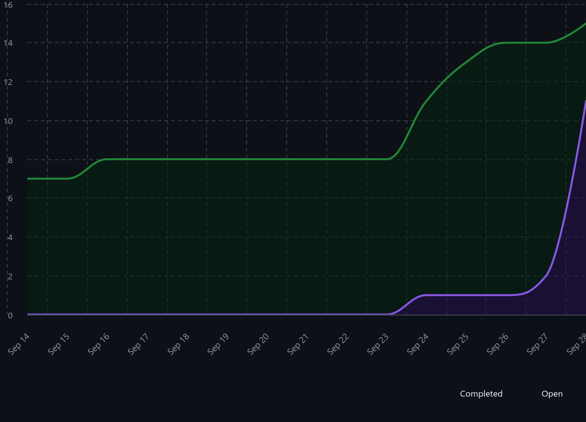
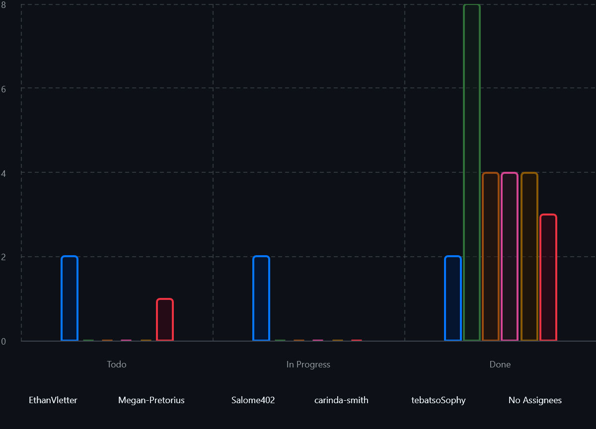
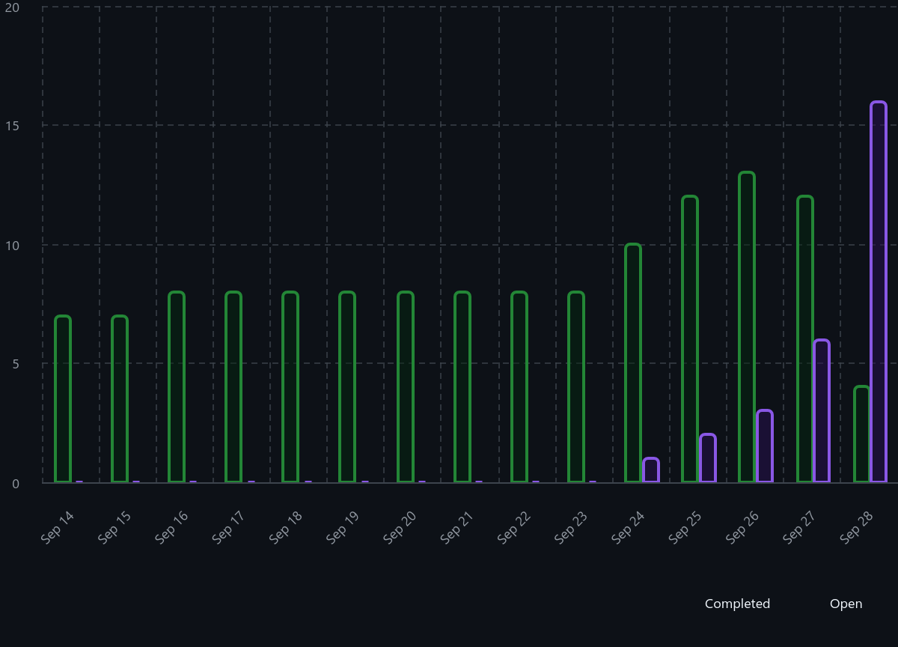
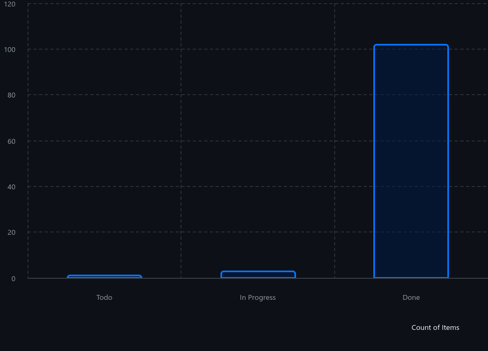

# Project Dashboard Summary

## 1. Burn-up Chart (`Burn-up.png`)

### Overview

This chart tracks:

- **Scope** (total work to be done) and
- **Progress** (amount of work completed over time).

- Completed(Purple)
- Open(Green)

## 2. Assignees Chart (`Assignees.png`)

### Overview

This chart displays the distribution of tasks among different team members.

- EthanVletter(Blue)
- Megan-Pretorius(Green)
- Salome402(Orange)
- carinda-smith(Pink)
- tebatsoSophy(Yellow)
- no Assignees(Red)

## 3. Issues(`Issues.png`)

### Overview

This chart displays the current status of tasks with dates assigned to them to show our work over time:

- To Do
- In Progress
- Done

- Completed(Purple)
- Open(Green)

## 4. Status Chart (`Status-chart.png`)

### Overview

This chart displays the current status of tasks:

- To Do
- In Progress
- Done

- Count of Items(Blue)
